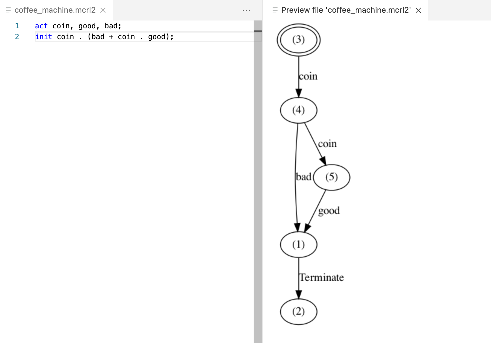
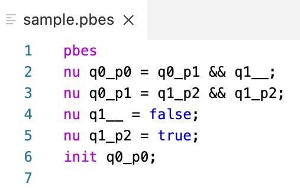

# mCRL2 Viewer (VSCode extension)

- Preview mCRL2 model using Graphviz engine (DOT)
- Visual Studio Code extension
- Checkout source code: https://github.com/trinnguyen/mcrl2-viewer

## Requirements
- Install three tools to the system and add to PATH environment variable: **mcrl22lps, lps2lts, dot**
    - mCRL2: https://www.mcrl2.org/web/user_manual/download.html
    - DOT: https://graphviz.org/download

## Features
- Preview mCRL2
    - Run VSCode command: **mCRL2: Preview** on the active .mcrl2 editor
    - Shortcut key: 
        - macOS: **cmd + shift + v**
        - Linux/Windows: **ctlr + shift + v**
- PBES Syntax highlight

## Screenshots
### Preview mCRL2

### PBES Syntax highlight
